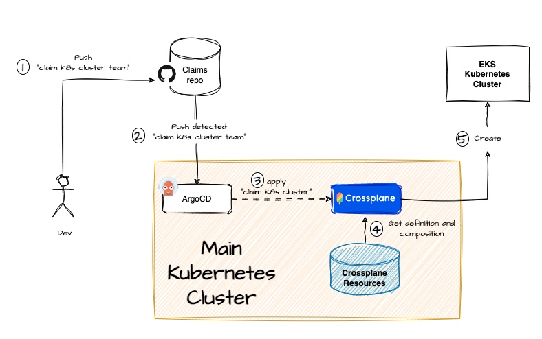
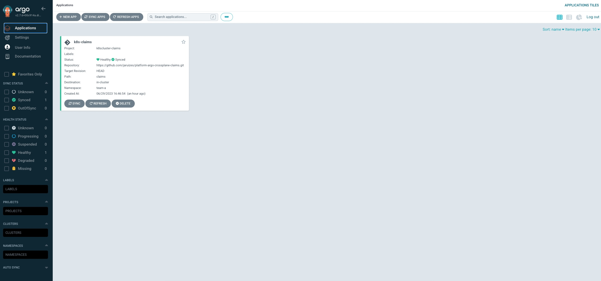
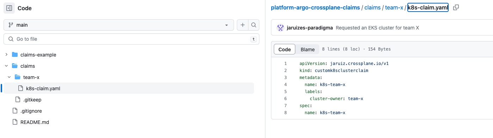

# Crossplane and ArgoCD to manage infrastructure


## Introduction

In this PoC you will learn how to manage cloud infrastructure by using Kubernetes, Crossplane and ArgoCD


## Pre-requisites

- AWS account
- [Eksctl](https://eksctl.io/)
- Kubectl
- Helm
- A Github token to access to claims repository

(*) If you don't have a Kubernetes instance, you can trry [K3d](https://k3d.io/v5.5.1/#quick-start) or execute the script "create-cluster.sh" to create a cluster in AWS (there is another script "delete-cluster.sh" to delete it.)


## Setting everything up

This image shows how the PoC works:




### Creating an initial Kubernetes cluster

So, the first step is to create an initial Kubernetes cluster in order to install Crossplane and ArgoCD. 


In this case, we are going to create an EKS cluster using [eksctl](https://eksctl.io/) and the cluster configuration is in the file *cluster-conf.yaml*. 

The following script encapsulates the cluster creation:

```bash
sh create-cluster.sh
```


### Installing ArgoCD and Crossplane

Once the main cluster is up and running, we have to install and configure [ArgoCD](https://argo-cd.readthedocs.io/en/stable/) and [Crossplane](https://www.crossplane.io/). To do this, just execute the following script:

```bash
sh setup.sh <AWS_ACCESS_KEY_ID> <AWS_SECRET_ACCESS_KEY> <GITHUB_TOKEN>
```


When the script ends, we'll see the url to access to ArgoCD and the credentials. Something like this:

```bash
ARGOCD URL: https://a8628e104aa7549c3a979c27185934f3-369920353.eu-west-2.elb.amazonaws.com:80/
ARGOCD Credentials: admin/FkmHYXTwAWT33eFZ
```


If we go to this URL we'll enter to ArgoCD and we have to check that the claims application is created:




### Deploying composite objects

Now, it's time to define how a k8s cluster is going to be created. We need to do these tasks:

- Defining a composition object for an EKS cluster (*crossplane/composite/eks-composition.yaml*)
- Creating a definition object and claim to request an EKS cluster  (*crossplane/composite/eks-definition.yaml*)


To install these objects, execute this command:

```shell
sh deploy-composite.sh
```


If we execute this command:

```bash
kubectl get Composition -n crossplane-system
```


we'll see our composition installed:

```bash
NAME               XR-KIND            XR-APIVERSION             AGE
customk8scluster   customk8scluster   jaruiz.crossplane.io/v1   7m2s
```


And if we execute:

```bash
kubectl get CompositeResourceDefinition
```


we'll see our composite definition installed:

```bash
NAME                                     ESTABLISHED   OFFERED   AGE
customk8sclusters.jaruiz.crossplane.io   True          True      9m3s
```


### Claim an EKS

Finally, we are going to request to create a new EKS cluster called "k8s-team-x". We have to push a new file to the [claims repository](https://github.com/jaruizes/platform-argo-crossplane-claims) , in the folder "claims/", in order to ArgoCD gets the change and applies for the cluster object to Crossplane. The claim file has the following structure:

```yaml
apiVersion: jaruiz.crossplane.io/v1
kind: customk8sclusterclaim
metadata:
  name: k8s-team-a
  labels:
    cluster-owner: team-a
spec:
  name: k8s-team-a
```

There is an example file in "claims-example/k8s-claim.yaml". The following picture shows how to do it:




Now, if we go to ArgoCD and we open the application we created before, we'll see how all the components associated to the composition are being created:


Besides that, we can check it using kubectl:

```bash
kubectl get clusters.eks.aws.upbound.io -n crossplane-system
```


we'll see how our cluster is ready:

```bash
NAME                 READY   SYNCED   EXTERNAL-NAME        AGE
k8s-team-x-cluster   True    True     k8s-team-x-cluster   9m59s
```


And, if can check the secret containing the connection details:

```bash
kubectl describe secret k8s-team-x-conn  -n crossplane-system
```


The result should be similar to this:

```bash
Name:         k8s-team-x-conn
Namespace:    crossplane-system
Labels:       <none>
Annotations:  <none>

Type:  connection.crossplane.io/v1alpha1

Data
====
clusterCA:   1099 bytes
endpoint:    72 bytes
kubeconfig:  2371 bytes

```


## Removing the environment

We have to perform two tasks:

- Remove the claim request to remove the environment for the Team X
- Remove the K8s main cluster


### Removing the claim

If we delete the file from the repository, the environment will be deleted by ArgoCD:


We can also check it using kubectl:

```bash
kubectl get clusters.eks.aws.upbound.io -n crossplane-system
```


we'll notice that the cluster is not ready now:

```bash
NAME                 READY   SYNCED   EXTERNAL-NAME        AGE
k8s-team-x-cluster   False   True     k8s-team-x-cluster   22m
```

And, if we execute the command some minutes later, we'll see that the resource isn't found.

We also can check AWS Console:


### Removing the main cluster

Once the team cluster is deleted we can destroy the main cluster executing:

```bash
sh delete-cluster.sh
```

