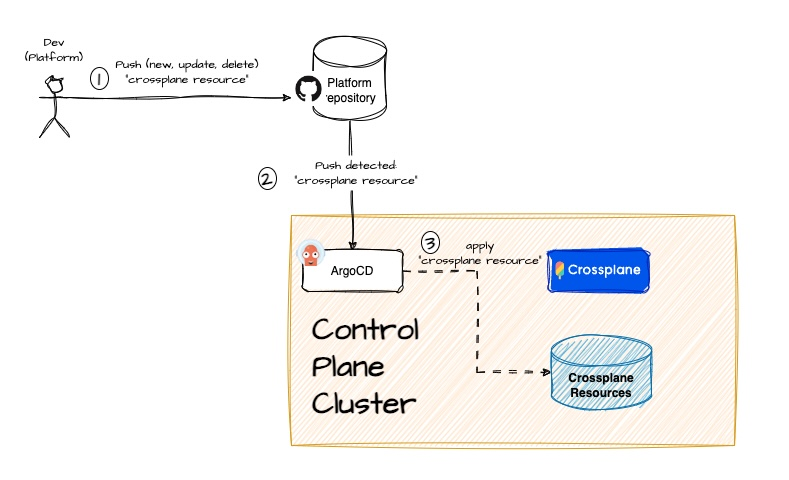

# Crossplane and ArgoCD to manage infrastructure


## Introduction

In this repository we are going to see how to automate the creation of a new development environment for a team. We'll provide an environment with these capabilities:


- A Kubernetes cluster ready to be used
- A set of git repositories
- A base platform ready with Kafka and Kafka tools, Redis, Postgresql, Prometheus or Grafana
- An example application using this platform in order to being used as starter point for the dev team
- A CI/CD based on Tekton and ArgoCD configured and ready


## Pre-requisites

- AWS account
- [Eksctl](https://eksctl.io/)
- Kubectl
- Helm
- Gitlab Account and token


## Repository structure (WIP)

This image shows the repository structure:


## The use case

In this PoC we are going to automate an IDP creation for our company. In our case, the current development environment is composed for these components: 


- A Kubernetes cluster
- A Postgresql instance
- A Kafka broker and some UI Tool
- Redis
- Prometheus and Grafana
- CI/CD


So, our teams need an IDP with these requirements. The following image describes these requirements:


Install and maintain this IDP isn't productive for development teams so it was decided to delegate these tasks to a Platform team in order to the development teams keep their focus on build business capabilities instead on keeping their environments up and running. 

This Platform team also needs to automate those kind of tasks in order to:

- Be more efficient, productive and avoid human mistakes when perform platform tasks
- Build golden paths over the platform to help the development teams to build business capabilities 
- Be able to evolve the platform 


*TODO: Governance, Networks, security groups, etc...Talking about how difficult are those points*


## Solution design

- Design the steps to provide an IDP

- Decide how the provisioning of the IDP is going to be automated

  

### IDP

The target of this stage is to provide an IDP ready to be used for the development teams. This IDP has to meet the requirements described above.

So, the platform team begins to design the platform and how it could be automated. In order to separate concerns and build an evolvable platform, they decided to perform multiple steps to build the IDP instead of having just one. So, the steps to automate the creation of the platform are summarized in this picture:


So, the steps are:

1. Automate the creation of the platform base, that means, creating the kubernetes cluster and the main database. The reasons to perform this step seperated are:

   - being able to choose different kubernetes and database providers (AWS, GCP, Azure,...) without impacting in development teams or even, being able to provide different physicall platforms depending on the needs. For instance: development, QA,...,etc

   - keeping the process of providing the main infrastructure isolated to be evolved when needed

     

2. Automate the creation of the platform tools. The reasons to perform this step seperated are:

   - adding, updating (for instance, versions) or deleting tools autonomously with minimum impact in development teams

   - being able to choose different options depending on the context. For instance: an open source Kafka provider for dev environments and a licensed Kafka provider for production environment

   - keeping the process of providing the platform tools isolated to be evolved when needed

     

3. Automate the creation of the development repositories and CI/CD tools. The reasons to perform this step seperated are:

   - providing repositories with the right structure and with an example of the component to develop (for instance: microservice, spa, etc...)
   - providing CI/CD tools ready to be used for the development teams, allowing them to easily build and deploy business features


### How to automate the provisioning of IDPs

Once the steps to provide an IDP are designed, the platform team has to decide what tools can use to automate the steps to build the IDP. 

The platform team chooses [Crossplane](https://www.crossplane.io/) and [ArgoCD](https://argo-cd.readthedocs.io/en/stable/) in order to create a control plane cluster to provide, centrally, the IDPs:


From this control plane, the different steps to create the IDP will be automated and managed.


### Putting everything together

#### The (k8s) control plane cluster

The following picture shows the target to achieve:


So, the first step is to create a K8s cluster to be the control plane cluster. In this PoC we are going to create and use an AWS EKS cluster but you can use other K8s distribution if you want. 

Let's see that in more detail how this cluster is going to be composed:


##### Crossplane

[Crossplane](https://www.crossplane.io/) is the core of our control plane cluster. By Crossplane, we'll automate the infrastructure creation using a declarative way (Kubernetes-style). So, we are going to deploy Crossplane and configure it with these components:

- Compositions, definitions and claims: in this PoC, we'll provide resources and claims to create an EKS cluster and a Postgresql RDS instance

- Providers: we'll install these providers:

  - AWS: this provider will be used to create and manage AWS infrastructure 
  - K8s: by this provider we'll be able to create objects in the managed kubernetes
  - Helm: to manage and deploy Helm charts in K8s clusters
  - Gitlab: we'll use this provider to create groups and projects in Gitlab in order to provide repositories to the different teams

   

##### ArgoCD

We are going to use [ArgoCD](https://argo-cd.readthedocs.io/en/stable/) to implement GitOps and being able to keep always synchronized Crossplane resources with the "Platform Repository". By this way, everytime a resource is updated in Git, the change is propagated automatically to our control plane cluster. 




We'll also use ArgoCD to manage the multiple claims requests to create infrastructure. So, when a dev team needs a Kubernetes cluster to build and deploy its applications, it creates a claim file and push it to "Claim Requests Repository". Then, ArgoCD pulls that change and creates a new claim object managed by Crossplane. Finally, Crossplane creates the infrastructure associated to that claim


#### Crossplane resources: compositions, definitions and claims

We are defined three stages to build and provision the complete platform:

1. Platform base: provisioning the kubernetes cluster and Postgresql instance
2. Platform tools: install and configure the platform tools over the kubernetes provisioned
3. Platform dev: create the different dev and Gitops repositories and install and configure CI/CD tools


Let's see which components are necessary in each stage:


##### Platform base

In this stage we need to create this crossplane objects:

- Composition: the compositi


## Hands-on


### Control Plane Cluster

The first step is creating and configuring the Control Plane Cluster. 

In this PoC, we are going to create an EKS cluster using [eksctl](https://eksctl.io/). The cluster configuration is in the file *cluster-conf.yaml*.


```yaml
apiVersion: eksctl.io/v1alpha5
kind: ClusterConfig

metadata:
  name: crossplane-poc-cluster
  region: eu-west-3
  version: "1.27"

nodeGroups:
  - name: ng-1
    instanceType: m5.xlarge
    desiredCapacity: 2
    volumeSize: 80
```


The following script encapsulates the cluster creation:

```bash
sh create-cluster.sh
```


Once the creation is finished, we have an empty EKS:


The next step is to configure ArgoCD and Crossplane.


### Installing ArgoCD and Crossplane

Once the main cluster is up and running, we have to install and configure [ArgoCD](https://argo-cd.readthedocs.io/en/stable/) and [Crossplane](https://www.crossplane.io/). To do this, just execute the following script:

```bash
sh setup_control_plane_cluster.sh <AWS_ACCESS_KEY_ID> <AWS_SECRET_ACCESS_KEY> <GITLAB_TOKEN>
```


When the script ends, we'll see the url to access to ArgoCD and the credentials. Something like this:

```bash
ARGOCD URL: https://a8628e104aa7549c3a979c27185934f3-369920353.eu-west-2.elb.amazonaws.com:80/
ARGOCD Credentials: admin/FkmHYXTwAWT33eFZ
```


Now, we have our control plane cluster ready:


If we go to ArgoCD url we'll see that there are no applications:


In the next steps, we'll create two applications: crossplane-resources and claims


### ArgoCD Applications

Now, we need to create two ArgoCD applications

- crossplane-resources
- claims


With these two applications, our control plane cluster will be ready to manage claims


To create the applications, just execute the following script:

```bash
sh setup_control_plane_argocd_apps.sh
```


Once the script finishes, if we enter to the ArgoCD url we'll see these two applications created:


Let's see them in more detail


#### ArgoCD App: crossplane-resources

We have to create an application to keep synchronized crossplane resources between the platform git repository and the control plane cluster. This app is listening for changes in "https://github.com/jaruizes/platform-argo-crossplane/platform-gitops-repositories/crossplane-resources" . So, if we add more crossplane composites or update what exists, ArgoCD applies those changes to the main kubernetes cluster. 


If you click in this app, you can see that the objects in "platform-gitops-repositories/crossplane-resources" are managed by ArgoCD:


ArgoCD has installed those objects in the cluster and keeps them synchronized with the repository. 

We can also check it directly against the cluster, executing this command:

```bash
kubectl get Composition -n crossplane-system
```


We'll see the composition installed:

```bash
NAME            XR-KIND         XR-APIVERSION             AGE
platformbase    platformbase    jaruiz.crossplane.io/v1   10m
platformtools   platformtools   jaruiz.crossplane.io/v1   10m
```


And if we execute:

```bash
kubectl get CompositeResourceDefinition -n crossplane-system
```


we'll see the composite definition installed:

```bash
NAME                                  ESTABLISHED   OFFERED   AGE
platformsbase.jaruiz.crossplane.io    True          True      11m
platformstools.jaruiz.crossplane.io   True          True      11m
```


#### ArgoCD App: **teams-claims**

This application is listening for changes in "https://github.com/jaruizes/platform-argo-crossplane/platform-gitops-repositories/claims" . So, a team wants to get a K8s cluster, the team will push a file containing the K8s claim in that path, ArgoCD will apply that change to the main kubernetes cluster and Crossplain will create the new cluster

If we click to see the details of the app, we'll see that there is no objects there. That is because we haven't requested any claim (that means that we haven't performed any push to "https://github.com/jaruizes/platform-argo-crossplane/platform-gitops-repositories/claims")


### Creating the IDP

Now it's time to create the IDP using the control plane cluster. As we said before, we've divided it into three steps:


In the following steps, we are going to push three claims to "https://github.com/jaruizes/platform-argo-crossplane/platform-gitops-repositories/claims" in order to create the IDP


#### Platform base

Now it's the moment to create a claim. You can find claim examples in the folder "claims-example" 

So, we copy the file "claims-example/platformbase-claim.yaml" to the folder "platform-gitops-repositories/claims" and call it "products-platform-base-claim.yaml", for instance. 

So, if we assume that we are going to create the base platform for the products team, the claim file will have the following content:

```yaml
apiVersion: jaruiz.crossplane.io/v1
kind: platformbaseclaim
metadata:
  name: products-base-platform
  labels:
    cluster-owner: products-team
spec:
  name: products
```


As you can see, in this claim we only can set the name of the team. In our case, we call it "products". 

Now, we push this file to the repository:


Now, if we go to ArgoCD and we open the application "**teams-claims**", we'll see how all the components associated to the composition are being created:


Besides that, we can check it using kubectl:

```bash
kubectl get clusters.eks.aws.upbound.io -n crossplane-system
```


we'll see how our cluster is ready:

```bash
NAME                 READY   SYNCED   EXTERNAL-NAME        AGE
k8s-team-x-cluster   True    True     k8s-team-x-cluster   9m59s
```


And, once the cluster is created, we can check the secret containing the connection details:

```bash
kubectl describe secret k8s-team-x-conn  -n crossplane-system
```


The result should be similar to this:

```bash
Name:         k8s-team-x-conn
Namespace:    crossplane-system
Labels:       <none>
Annotations:  <none>

Type:  connection.crossplane.io/v1alpha1

Data
====
clusterCA:   1099 bytes
endpoint:    72 bytes
kubeconfig:  2371 bytes

```


## Removing the environment

We have to perform two tasks:

- Remove the claim request to remove the environment for the Team X
- Remove the K8s main cluster


### Removing the claim

If we delete the file from the repository and we push the change:


the cluster for the team X will be deleted by ArgoCD:


We can also check it using kubectl:

```bash
kubectl get clusters.eks.aws.upbound.io -n crossplane-system
```


we'll notice that the cluster is not ready now:

```bash
NAME                 READY   SYNCED   EXTERNAL-NAME        AGE
k8s-team-x-cluster   False   True     k8s-team-x-cluster   22m
```

And, if we execute the command some minutes later, we'll see that the resource isn't found.

We also can check AWS Console:


### Removing the main cluster

Once the team cluster is deleted we can destroy the main cluster executing:

```bash
sh delete-cluster.sh
```


## Next steps

- Crossplane testing: how to test compositions, definitions, etc...
- A dev portal like Backstage
