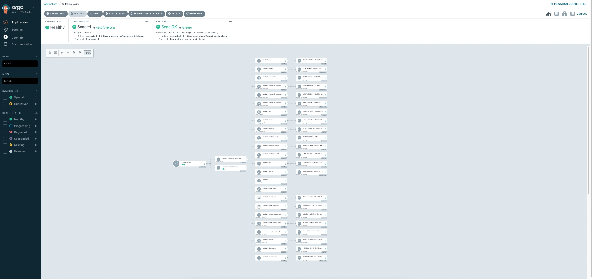

# Crossplane and ArgoCD to manage infrastructure


## Introduction

In this PoC you will learn how to manage cloud infrastructure by using Kubernetes, Crossplane and ArgoCD


## Pre-requisites

- AWS account
- [Eksctl](https://eksctl.io/)
- Kubectl
- Helm


## Repository structure

This image shows the repository structure:


## Setting everything up

This image shows how the PoC works:


### Creating an initial Kubernetes cluster

So, the first step is to create an initial Kubernetes cluster in order to install Crossplane and ArgoCD.


In this case, we are going to create an EKS cluster using [eksctl](https://eksctl.io/) and the cluster configuration is in the file *cluster-conf.yaml*.

The following script encapsulates the cluster creation:

```bash
sh create-cluster.sh
```


### Installing ArgoCD and Crossplane

Once the main cluster is up and running, we have to install and configure [ArgoCD](https://argo-cd.readthedocs.io/en/stable/) and [Crossplane](https://www.crossplane.io/). To do this, just execute the following script:

```bash
sh setup.sh <AWS_ACCESS_KEY_ID> <AWS_SECRET_ACCESS_KEY>
```


When the script ends, we'll see the url to access to ArgoCD and the credentials. Something like this:

```bash
ARGOCD URL: https://a8628e104aa7549c3a979c27185934f3-369920353.eu-west-2.elb.amazonaws.com:80/
ARGOCD Credentials: admin/FkmHYXTwAWT33eFZ
```


If we go to this URL we'll enter to ArgoCD and we'll see that there are two applications created:


Why those two applications?

#### ArgoCD App: crossplane-resources

This app is listening for changes in "https://github.com/jaruizes/platform-argo-crossplane/crossplane/resources" . So, if we add more crossplane composites or update what exists, ArgoCD applies those changes to the main kubernetes cluster. 

If you click in this app, you can see that two objects are managed by ArgoCD:


Those objects are:

- EKS Composition, defined in "*crossplane/resources/aws/composite/eks/eks-composition.yaml*"
- EKS Composite Resource Definition, defined in "*crossplane/resources/aws/composite/eks/eks-definition.yaml*"


So, ArgoCD has installed those objects in the cluster and keeps them synchronized with the repository. We can check it executing this command:

```bash
kubectl get Composition -n crossplane-system
```


We'll see the composition installed:

```bash
NAME               XR-KIND            XR-APIVERSION             AGE
customk8scluster   customk8scluster   jaruiz.crossplane.io/v1   7m2s
```


And if we execute:

```bash
kubectl get CompositeResourceDefinition
```


we'll see the composite definition installed:

```bash
NAME                                     ESTABLISHED   OFFERED   AGE
customk8sclusters.jaruiz.crossplane.io   True          True      9m3s
```


#### ArgoCD App: **teams-claims**

This application is listening for changes in "https://github.com/jaruizes/platform-argo-crossplane/teams" . So, a team wants to get a K8s cluster, the team will push a file containing the K8s claim in that path, ArgoCD will apply that change to the main kubernetes cluster and Crossplain will create the new cluster

If we click to see the details of the app, we'll see that there is no objects there. That is because we haven't requested any claim (that means that we haven't performed any push to "https://github.com/jaruizes/platform-argo-crossplane/teams")


### Claiming an EKS

Now it's the moment to create a claim. We are going to request to create a new EKS cluster called "k8s-team-x". We have to push a new file to "https://github.com/jaruizes/platform-argo-crossplane/teams".

The claim file has the following structure (there is an example in "*crossplane/claim-example/k8s-claim.yaml*":

```yaml
apiVersion: jaruiz.crossplane.io/v1
kind: customk8sclusterclaim
metadata:
  name: k8s-team-x
  labels:
    cluster-owner: team-x
spec:
  name: k8s-team-x
```


So, we create a new file called, for instance, "team-x-eks-claim.yaml", with that content, and push it to the repository:


Now, if we go to ArgoCD and we open the application "**teams-claims**", we'll see how all the components associated to the composition are being created:




Besides that, we can check it using kubectl:

```bash
kubectl get clusters.eks.aws.upbound.io -n crossplane-system
```


we'll see how our cluster is ready:

```bash
NAME                 READY   SYNCED   EXTERNAL-NAME        AGE
k8s-team-x-cluster   True    True     k8s-team-x-cluster   9m59s
```


And, once the cluster is created, we can check the secret containing the connection details:

```bash
kubectl describe secret k8s-team-x-conn  -n crossplane-system
```


The result should be similar to this:

```bash
Name:         k8s-team-x-conn
Namespace:    crossplane-system
Labels:       <none>
Annotations:  <none>

Type:  connection.crossplane.io/v1alpha1

Data
====
clusterCA:   1099 bytes
endpoint:    72 bytes
kubeconfig:  2371 bytes

```


## Removing the environment

We have to perform two tasks:

- Remove the claim request to remove the environment for the Team X
- Remove the K8s main cluster


### Removing the claim

If we delete the file from the repository and we push the change:


the cluster for the team X will be deleted by ArgoCD:


We can also check it using kubectl:

```bash
kubectl get clusters.eks.aws.upbound.io -n crossplane-system
```


we'll notice that the cluster is not ready now:

```bash
NAME                 READY   SYNCED   EXTERNAL-NAME        AGE
k8s-team-x-cluster   False   True     k8s-team-x-cluster   22m
```

And, if we execute the command some minutes later, we'll see that the resource isn't found.

We also can check AWS Console:


### Removing the main cluster

Once the team cluster is deleted we can destroy the main cluster executing:

```bash
sh delete-cluster.sh
```

